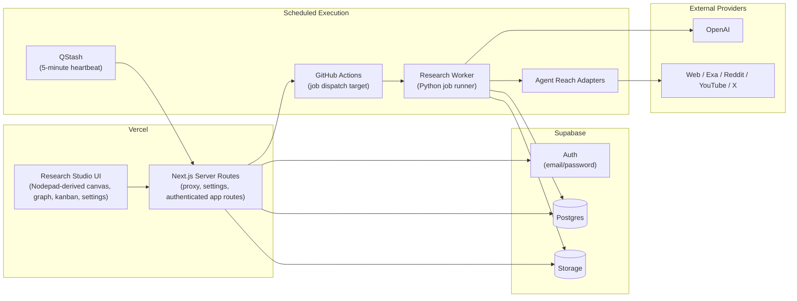
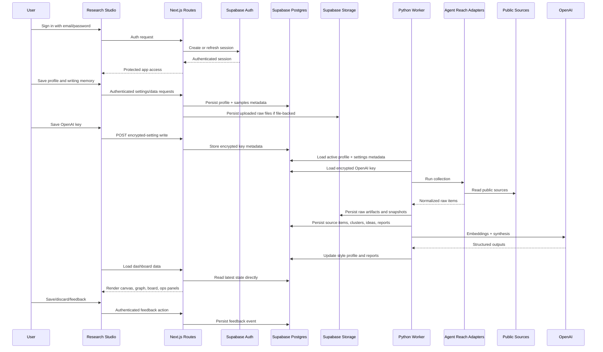

# Content Research Studio: Source of Truth

## Executive Summary

Content Research Studio is a private, single-user research system for continuously discovering, filtering, connecting, and ranking public content signals that matter to one writer. The product is not a browser-local note toy and not a generic chat interface. It is a continuously running research environment that watches public sources, learns the user’s niche and writing patterns, and turns those signals into idea cards and outlines that are worth writing.

The target architecture has four major parts:

1. `nodepad-main/` is the frontend Research Studio. It provides the canvas, graph, kanban, dashboard controls, and settings UX.
2. Supabase is the system of record for authentication, relational data, and object storage.
3. `agent_reach/research/` remains the Python execution engine for source collection, normalization, clustering, scoring, style learning, and digest generation.
4. `agent_reach/` remains the source-access and adapter layer for web and social channels.

The system does not end after one run. QStash-triggered scheduling and GitHub Actions own recurring dispatch and Python job execution for incremental collection, daily synthesis, and weekly digest publication. The dashboard is hosted on Vercel. Supabase provides email/password auth, Postgres, and Storage. OpenAI remains the primary model provider, but keys are entered through the authenticated app settings UI and stored encrypted server-side. Browser `localStorage` and browser-held provider keys are not allowed as product architecture.

This document is the canonical implementation contract for the product.

## Product Goals

The product exists to deliver these outcomes:

1. Continuously discover niche-relevant public content without requiring manual platform hopping.
2. Maintain a durable research library of source items, topic clusters, creator watchlists, idea cards, reports, and user feedback.
3. Learn the user’s writing boundaries from uploaded writing samples and LinkedIn history.
4. Rank content by niche fit, novelty, style fit, and cross-source confirmation instead of pure virality.
5. Generate evidence-backed idea cards and outlines for channels such as LinkedIn.
6. Let the user explore relationships between ideas spatially through canvas, graph, and kanban views.
7. Keep improving from save, discard, and feedback actions.

## Non-Goals

The system explicitly does not do the following in v1:

1. Auto-post to LinkedIn, X, or any other platform.
2. Behave like a general-purpose chat assistant.
3. Operate as a multi-user SaaS workspace product.
4. Run long-lived research jobs inside Vercel serverless functions.
5. Treat browser state or `.nodepad` files as the primary source of truth.
6. Store model provider keys in browser env or `localStorage`.
7. Keep the original standalone browser-local Nodepad product in parallel.

## Key Decisions

These are fixed decisions:

1. The product is a single-user private system.
2. `agent_reach` remains the source-access and adapter layer.
3. `nodepad-main` is reused as the frontend shell and interaction model, not as the execution engine.
4. Vercel hosts the frontend and Next.js server routes.
5. Supabase is the system of record for auth, relational data, and blob storage.
6. Supabase Auth uses email/password.
7. Python remains the execution engine for collection and synthesis, but the default hosted runtime is QStash plus GitHub Actions instead of an always-on worker host.
8. OpenAI is the primary model provider.
9. The research profile and OpenAI key are managed from the app settings page.
10. The OpenAI key is configured in the app settings UI and stored encrypted server-side.
11. Runtime cadence is fixed at:
    - scheduler heartbeat every 5 minutes
    - incremental collection every 4 hours
    - one daily synthesis run
    - one weekly digest run
12. Output scope is ideas plus outlines, not autonomous posting.
13. The old standalone/local-browser Nodepad app is removed from the product.

## Why Nodepad Is Included

Nodepad is included for its interaction model, not for its original local-only architecture.

The product reuses:

1. the spatial canvas model,
2. the graph view,
3. the kanban view,
4. the typed block model,
5. the relationship visualization model,
6. the “ghost synthesis” interaction pattern,
7. the `.nodepad` export concept as a portable research snapshot.

The original standalone Nodepad implementation is not acceptable as product architecture because it relied on:

1. `localStorage` persistence,
2. browser-held provider keys,
3. direct client-to-provider AI requests,
4. single-page client state as the durable source of truth,
5. no backend auth,
6. no long-running worker.

Those behaviors are removed from the research product.

## Reuse Boundaries

### What is reused from `nodepad-main`

1. The canvas, graph, and kanban interaction model.
2. Shared block rendering infrastructure such as tiling, graph, kanban, and tile card components.
3. The `.nodepad` snapshot export format.
4. The visual language for the research workspace.

### What is replaced in `nodepad-main`

1. Browser `localStorage` as the source of truth.
2. Browser-stored provider keys.
3. Direct browser AI calls.
4. The original standalone landing page and its local-only flows.
5. Owner-token login.

### What remains inside `agent_reach`

1. Source adapters and upstream tool invocation.
2. Source health and availability checks.
3. Channel-specific data collection logic.

`agent_reach` does not become the frontend app, auth system, or browser dashboard.

## System Architecture



### Component Responsibilities

#### Research Studio frontend

The frontend is responsible for:

1. user sign-in and sign-out,
2. profile editing from the settings page,
3. writing-sample intake,
4. LinkedIn history import initiation,
5. browsing clusters, ideas, creators, and weekly reports,
6. save, discard, and feedback actions,
7. OpenAI key management through the settings page,
8. operational visibility through health and verification panels,
9. desktop-first layout for v1 (the shell is not built as a primary mobile research client; small viewports may be gated).

#### Next.js server routes

The Next.js server layer is responsible for:

1. enforcing authenticated access,
2. serving authenticated dashboard reads and user-triggered writes directly against Supabase, with the Python API kept only as an optional operator fallback,
3. handling encrypted settings writes and reads,
4. preventing direct browser access to backend secrets,
5. bridging frontend sessions to backend operations.

#### Supabase

Supabase is the system of record for:

1. auth sessions,
2. primary relational data,
3. encrypted app settings metadata,
4. raw artifacts and exports.

#### Python worker

The Python worker is responsible for:

1. scheduled collection,
2. normalization,
3. clustering,
4. scoring,
5. style learning,
6. idea generation,
7. weekly digest publication.

#### OpenAI

OpenAI is used server-side or worker-side only for:

1. embeddings,
2. style extraction,
3. cluster labeling,
4. idea synthesis,
5. outline generation.

## End-to-End Data Flow



## Runtime and Scheduling

The product never has a terminal done state.

The runtime rules are:

1. The scheduler heartbeat runs every 5 minutes.
2. Incremental source collection runs every 4 hours.
3. Daily synthesis runs once per day at the configured local hour.
4. Weekly digest runs once per week at the configured weekday and hour.
5. Only one active run per job type may exist at a time for the single-user workspace.
6. Failed jobs are retried with bounded backoff and logged.
7. On restart, the worker reconciles missed jobs from durable state.
8. Source failures degrade the report instead of aborting the full pipeline.

## Source Collection Logic

### Web / Exa

Purpose:

1. broad trend discovery,
2. named topics,
3. articles and commentary,
4. broader context beyond social chatter.

Risks:

1. result noise,
2. parser drift,
3. article duplication.

Fallback:

1. if unavailable, continue with Reddit, YouTube, and X,
2. do not fail the full run.

### Reddit

Purpose:

1. pain points,
2. objections,
3. recurring questions,
4. language patterns.

Risks:

1. noisy threads,
2. sampling bias,
3. changing CLI availability.

Fallback:

1. mark degraded,
2. continue with other sources.

### YouTube

Purpose:

1. deeper educational themes,
2. transcript-backed angles,
3. creator/channel discovery.

Risks:

1. transcript quality,
2. incomplete comment extraction,
3. noisy metadata.

Fallback:

1. continue without video-derived ideas,
2. preserve other source families.

### X

Purpose:

1. fast-moving creator language,
2. early trend detection,
3. phrasing and framing patterns.

Risks:

1. highest maintenance source,
2. auth/cookie fragility,
3. unstable search behavior.

Fallback:

1. treat X as optional in degraded mode,
2. never block the full report on X health.

## Style Learning Logic

### Research Profile

The Research Profile is the user-defined targeting layer. It contains:

1. name,
2. persona brief,
3. niche definition,
4. must-track topics,
5. excluded topics,
6. target audience,
7. desired formats.

### Style Profile

The Style Profile is the learned signal layer. It contains:

1. tone markers,
2. hook patterns,
3. structure patterns,
4. preferred topics,
5. avoided topics,
6. evidence preferences,
7. model-generated summary.

### Learning inputs

Style learning uses:

1. uploaded writing samples,
2. imported LinkedIn history,
3. save/discard/feedback actions.

### Feedback loop

User actions affect future ranking:

1. `save` reinforces adjacent topics and angles,
2. `discard` lowers similar angles,
3. `feedback` provides extra language for future fit scoring,
4. style refresh jobs incorporate those events into future profile generation.

## Ranking and Idea Logic

The ranking formula is fixed:

```text
final_score = 0.30 engagement + 0.30 niche_fit + 0.15 novelty + 0.15 cross_source_confirmation + 0.10 style_alignment
```

Definitions:

1. `engagement`: normalized public signal strength from likes, comments, recurrence, and other source-specific engagement proxies.
2. `niche_fit`: alignment with the Research Profile’s niche and topic boundaries.
3. `novelty`: distance from already-surfaced ideas so the system avoids repeating itself.
4. `cross_source_confirmation`: boost when the same theme appears across multiple source families.
5. `style_alignment`: similarity to the learned Style Profile.

Cross-source confirmation operates at the cluster level, not the single-post level. If multiple different source families point at the same theme, the cluster score increases.

## Data Model

Supabase Postgres stores these entities:

| Entity | Purpose | Required fields | Owner |
| --- | --- | --- | --- |
| `research_profiles` | Research targeting definition | `id`, `name`, `persona_brief`, `niche_definition`, `must_track_topics`, `excluded_topics`, `target_audience`, `desired_formats`, timestamps | Research app + worker |
| `writing_samples` | User writing memory | `id`, `research_profile_id`, `source_type`, `title`, `raw_text`, `raw_blob_url`, `language`, `created_at` | Research app + worker |
| `style_profiles` | Learned style output | `id`, `research_profile_id`, tone/hook/structure/topic arrays, `raw_summary`, `generated_at` | Worker |
| `creator_watchlists` | Creators worth following | `id`, `research_profile_id`, `source`, `creator_external_id`, `creator_name`, `creator_url`, `watch_reason`, `watch_score`, `updated_at` | Worker |
| `source_items` | Normalized collected items | `id`, `research_profile_id`, `source`, `external_id`, `canonical_url`, `author_name`, `published_at`, `title`, `body_text`, `engagement_json`, `raw_blob_url`, `health_status`, `source_query`, `created_at` | Worker |
| `topic_clusters` | Clustered topic groups | `id`, `research_profile_id`, `cluster_label`, `cluster_summary`, `representative_terms`, `supporting_item_ids`, `source_family_count`, `freshness_score`, `cluster_key`, `final_score`, `score_components`, `rank_snapshot_at` | Worker |
| `idea_cards` | Ranked writing ideas | `id`, `research_profile_id`, `topic_cluster_id`, `headline`, `hook`, `why_now`, `outline_md`, `evidence_item_ids`, `final_score`, `status`, `generated_at` | Worker + app |
| `weekly_reports` | Published weekly digests | `id`, `research_profile_id`, `report_period_start`, `report_period_end`, `top_idea_ids`, `top_creator_ids`, `summary_md`, `published_at` | Worker |
| `user_feedback_events` | Save/discard/feedback memory | `id`, `research_profile_id`, `idea_card_id`, `event_type`, `event_payload`, `created_at` | App + worker |
| `job_runs` | Durable scheduler state | `id`, `research_profile_id`, `job_type`, `status`, timestamps, `attempt_count`, `input_snapshot`, `error_summary`, `next_run_at`, `heartbeat_at` | Worker |
| `research_user_settings` | Encrypted user settings metadata | `user_id`, encrypted OpenAI key fields, masked display fields, timestamps | App + worker |

Supabase Storage stores:

1. raw source artifacts,
2. writing sample uploads when file-backed,
3. `.nodepad` research snapshot exports,
4. optional future generated attachments.

## API Surface

The product has three layers: Next.js settings routes, the Next research proxy, and the Python Research API upstream.

### Next.js authenticated routes

These are browser-facing and Supabase-authenticated:

1. `POST /api/settings/openai`
   - input: `apiKey`
   - output: masked metadata only
2. `GET /api/settings/openai`
   - output: `configured`, `last4`, `updatedAt`
3. `DELETE /api/settings/openai`
   - output: confirmation

### Python Research API (upstream paths)

These paths are implemented by the Python HTTP server (`agent_reach/research/api.py`). They are reached at the configured base URL (for example `http://127.0.0.1:8877` in local dev). When `RESEARCH_API_ACCESS_TOKEN` / `AGENT_REACH_RESEARCH_API_ACCESS_TOKEN` is set, requests must include header `X-Research-Api-Token` with that value (the `/health` check route is unauthenticated in the usual sense of the product health probe).

**Read**

1. `GET /health` — liveness
2. `GET /api/profile` — active or selected profile
3. `GET /api/library/source-items` — paginated source items
4. `GET /api/library/clusters` — topic clusters
5. `GET /api/library/ideas` — idea cards (optional `status` filter)
6. `GET /api/library/creators` — creator watchlist
7. `GET /api/reports/latest` — latest weekly report
8. `GET /api/jobs` — recent job runs
9. `GET /api/system/health` — system health report
10. `GET /api/dashboard` — aggregated dashboard payload (profile, library slices, jobs, metrics)

**Write / actions**

1. `POST /api/profile` — create or update research profile
2. `POST /api/profile/writing-samples` — add writing samples
3. `POST /api/profile/linkedin-import` — import LinkedIn-style posts
4. `POST /api/ideas/:id/save`
5. `POST /api/ideas/:id/discard`
6. `POST /api/ideas/:id/feedback`
7. `POST /api/runs/manual` — trigger a manual job
8. `POST /api/system/verify` — storage / sources / combined verification

### Browser-facing research proxy (Next.js)

Client-side code and the browser must not call the Python origin directly. They call Next.js under **`/api/research/`** plus the **same upstream path string** as above. The catch-all route `app/api/research/[...path]/route.ts` forwards method, body, and query to Python and attaches the backend token from server env.

Examples:

- `GET /api/research/api/dashboard`
- `POST /api/research/api/profile`
- `POST /api/research/api/runs/manual`

### Server-side rendering (Next server to Supabase)

Server-rendered dashboard pages read directly from Supabase through authenticated Next.js server code. The Python API is no longer the normal read path for dashboard rendering.

## Worker Jobs

The worker keeps these job types:

| Job | Trigger | Inputs | Outputs | Idempotency rule | Failure handling |
| --- | --- | --- | --- | --- | --- |
| `collect_sources` | scheduler/manual | profile, source adapters | `source_items`, raw artifacts | upsert by profile/source/external ID | degrade source, continue |
| `discover_creators` | scheduler/manual | recent source items | `creator_watchlists` | upsert by profile/source/creator | retry on transient failure |
| `refresh_style_profile` | scheduler/manual | profile, writing samples, feedback, OpenAI key | `style_profiles` | latest profile replaces prior active output | fallback to heuristic style build |
| `cluster_items` | scheduler/manual | source items | `topic_clusters` | upsert by cluster key | retry and keep prior clusters |
| `rank_topics` | scheduler/manual | profile, style profile, clusters | ranked clusters | overwrite latest rank snapshot | keep prior scores on failure |
| `generate_ideas` | scheduler/manual | ranked clusters, OpenAI key | `idea_cards` | upsert by profile/cluster | fallback template generation |
| `publish_weekly_digest` | weekly/manual | top ideas, creators | `weekly_reports`, snapshot export | one report per period | retry and keep prior report |

## Deployment Architecture

Use [research-deployment.md](./research-deployment.md) as the canonical deployment runbook.

### Vercel responsibilities

1. host the frontend,
2. host authenticated Next.js routes,
3. manage Supabase browser/server session flow,
4. read and write research dashboard data directly against Supabase,
5. expose the internal scheduler route for QStash delivery.

### Background execution responsibilities

1. dispatch claimed jobs through GitHub Actions,
2. execute Python jobs against Supabase Postgres and Storage,
3. read encrypted OpenAI settings server-side.

### Secret boundaries

Browser-safe env:

1. `NEXT_PUBLIC_SUPABASE_URL`
2. `NEXT_PUBLIC_SUPABASE_ANON_KEY`

Server-only env:

1. `RESEARCH_API_ACCESS_TOKEN`
2. `RESEARCH_SETTINGS_ENCRYPTION_KEY`
3. `AGENT_REACH_RESEARCH_DB_DSN`
4. `AGENT_REACH_RESEARCH_SUPABASE_OWNER_USER_ID` if needed for the worker
5. `AGENT_REACH_RESEARCH_SUPABASE_SERVICE_ROLE_KEY`
6. optional fallback `OPENAI_API_KEY`

## Security and Operational Safety

The security rules are:

1. The OpenAI key may be entered from the UI but must never be returned plaintext after save.
2. The OpenAI key must never be stored in `localStorage`, frontend env, or client-readable config.
3. Supabase Auth protects dashboard and app routes.
4. The browser never talks directly to the Python runtime; scheduled execution happens through QStash and GitHub Actions.
5. Raw artifacts should use controlled retention and cleanup.
6. Any fetch proxy behavior must protect against becoming an open proxy or SSRF surface.
7. X remains the highest-risk source and should be treated as optional under degraded mode.

## Failure Modes and Fallbacks

Documented failure modes:

1. Source failure:
   - mark degraded,
   - continue remaining source families,
   - show operator hint in dashboard.
2. Partial run failure:
   - persist partial job state,
   - retry from durable scheduler state.
3. OpenAI failure:
   - use heuristic style/idea fallback where possible,
   - preserve collected research state.
4. DB failure:
   - fail the current job,
   - surface the error in health and verification.
5. Worker restart:
   - reconcile due jobs from durable job state.
6. Stale LinkedIn import:
   - preserve prior content,
   - allow manual re-import.

## Implementation Phases

### Phase 1: rewrite docs and env setup

Exit criteria:

1. source-of-truth updated to Supabase-first architecture,
2. setup docs and env examples no longer mention owner-token auth,
3. old browser-local provider-key guidance is removed.

### Phase 2: Supabase auth and settings

Exit criteria:

1. `/research` is protected by Supabase Auth,
2. login is email/password based,
3. settings UI supports OpenAI key save/update/delete,
4. key is stored encrypted server-side,
5. owner-token flow is removed.

### Phase 3: Supabase-backed persistence

Exit criteria:

1. research data runs against Supabase Postgres,
2. raw artifacts and exports use Supabase Storage,
3. worker can load encrypted OpenAI settings from Supabase-backed storage.

### Phase 4: remove old standalone Nodepad app

Exit criteria:

1. the old standalone landing page and local-only AI flows are removed,
2. dead files and generated junk are deleted,
3. the app is clearly a single research product.

### Phase 5: hardening and verification

Exit criteria:

1. auth works end to end,
2. settings encryption works end to end,
3. worker can operate with Supabase-backed config,
4. docs and env examples match reality.

## Testing and Acceptance

The minimum acceptance checks are:

1. email/password auth works end to end,
2. unauthenticated users cannot access `/research`,
3. settings UI can save and clear the OpenAI key,
4. saved key is not returned plaintext,
5. worker can resolve the stored key server-side,
6. Supabase Postgres stores and serves profile, ideas, reports, and feedback,
7. Supabase Storage stores artifacts and exports,
8. removed standalone files are no longer imported,
9. setup docs work for a new local/prod deployment.

## Deferred Work

Deferred from v1:

1. auto-posting,
2. multi-user productization,
3. richer analytics and publishing metrics,
4. more source families beyond the current set,
5. true LinkedIn account sync instead of manual import,
6. replacing the backend token bridge with a stronger service-to-service auth model.

## Glossary

- `Research Profile`: the user-defined niche and audience targeting record.
- `Style Profile`: the learned writing-style summary generated from samples and feedback.
- `Source Item`: one normalized collected content record from a public source.
- `Topic Cluster`: a grouped theme built from related source items.
- `Idea Card`: a ranked writing opportunity with hook, why-now, and outline.
- `Ghost Synthesis`: a background-generated connective insight surfaced from the current research space.
